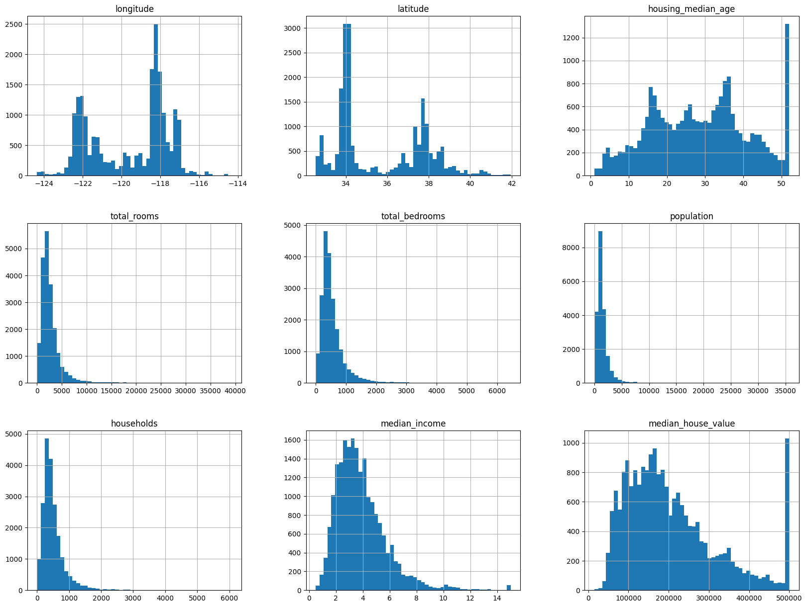
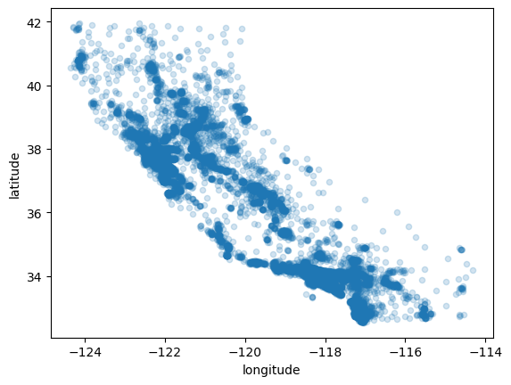
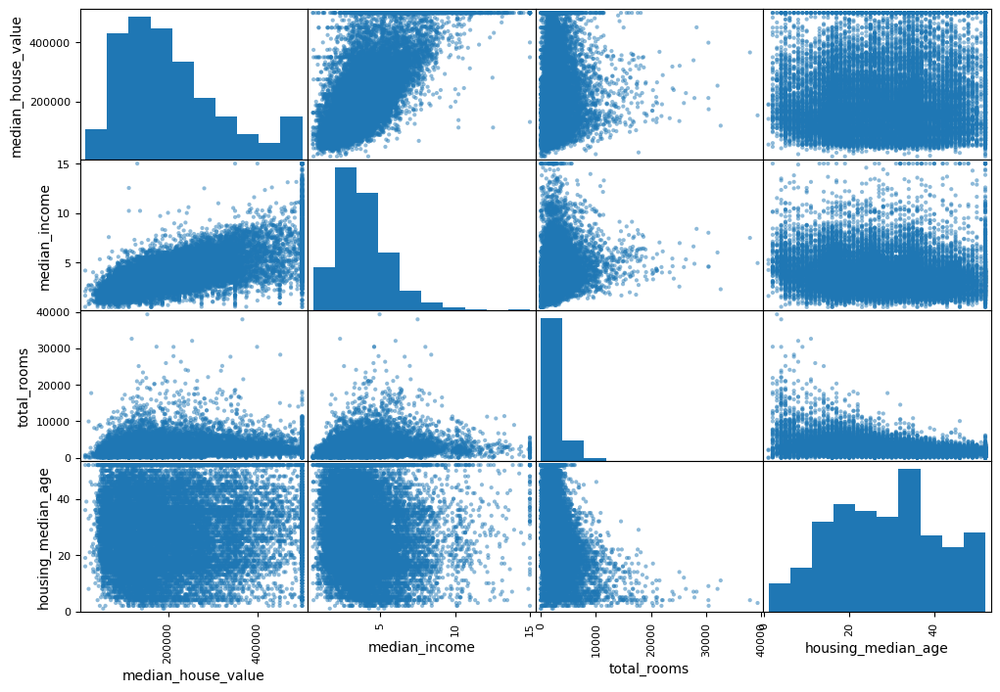
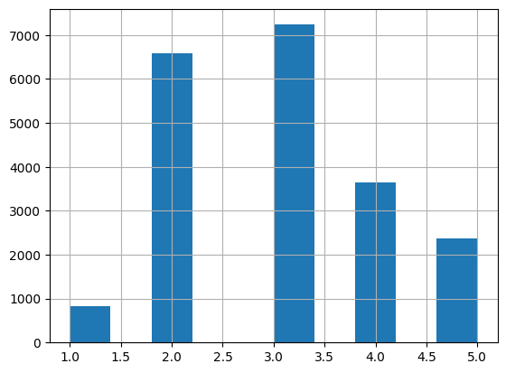

```python
# downloading the dataset;
import os
import tarfile
from six.moves import urllib
DOWNLOAD_ROOT = "https://raw.githubusercontent.com/ageron/handson-ml2/master/"
HOUSING_PATH = os.path.join("datasets", "housing")
HOUSING_URL = DOWNLOAD_ROOT + "datasets/housing/housing.tgz"
def fetch_housing_data(housing_url=HOUSING_URL, housing_path=HOUSING_PATH):
    if not os.path.isdir(housing_path):
        os.makedirs(housing_path)
    tgz_path = os.path.join(housing_path, "housing.tgz")
    urllib.request.urlretrieve(housing_url, tgz_path)
    housing_tgz = tarfile.open(tgz_path)
    housing_tgz.extractall(path=housing_path)
    housing_tgz.close()

fetch_housing_data(HOUSING_URL, HOUSING_PATH)
```

    /var/folders/lb/1n5g_7lx35x23mgxk16m40wc0000gn/T/ipykernel_23023/2926565965.py:14: DeprecationWarning: Python 3.14 will, by default, filter extracted tar archives and reject files or modify their metadata. Use the filter argument to control this behavior.
      housing_tgz.extractall(path=housing_path)


```python
# loading the dataset in memory and coverting to a pandas dataframe 

import pandas as pd
import os
HOUSING_PATH = os.path.join("datasets", "housing")
def load_housing_data(housing_path=HOUSING_PATH): 
    csv_path = os.path.join(housing_path, "housing.csv") 
    return pd.read_csv(csv_path)

housing = load_housing_data()
housing.head()
```


<div>
<style scoped>
    .dataframe tbody tr th:only-of-type {
        vertical-align: middle;
    }

    .dataframe tbody tr th {
        vertical-align: top;
    }

    .dataframe thead th {
        text-align: right;
    }
</style>
<table border="1" class="dataframe">
  <thead>
    <tr style="text-align: right;">
      <th></th>
      <th>longitude</th>
      <th>latitude</th>
      <th>housing_median_age</th>
      <th>total_rooms</th>
      <th>total_bedrooms</th>
      <th>population</th>
      <th>households</th>
      <th>median_income</th>
      <th>median_house_value</th>
      <th>ocean_proximity</th>
    </tr>
  </thead>
  <tbody>
    <tr>
      <th>0</th>
      <td>-122.23</td>
      <td>37.88</td>
      <td>41.0</td>
      <td>880.0</td>
      <td>129.0</td>
      <td>322.0</td>
      <td>126.0</td>
      <td>8.3252</td>
      <td>452600.0</td>
      <td>NEAR BAY</td>
    </tr>
    <tr>
      <th>1</th>
      <td>-122.22</td>
      <td>37.86</td>
      <td>21.0</td>
      <td>7099.0</td>
      <td>1106.0</td>
      <td>2401.0</td>
      <td>1138.0</td>
      <td>8.3014</td>
      <td>358500.0</td>
      <td>NEAR BAY</td>
    </tr>
    <tr>
      <th>2</th>
      <td>-122.24</td>
      <td>37.85</td>
      <td>52.0</td>
      <td>1467.0</td>
      <td>190.0</td>
      <td>496.0</td>
      <td>177.0</td>
      <td>7.2574</td>
      <td>352100.0</td>
      <td>NEAR BAY</td>
    </tr>
    <tr>
      <th>3</th>
      <td>-122.25</td>
      <td>37.85</td>
      <td>52.0</td>
      <td>1274.0</td>
      <td>235.0</td>
      <td>558.0</td>
      <td>219.0</td>
      <td>5.6431</td>
      <td>341300.0</td>
      <td>NEAR BAY</td>
    </tr>
    <tr>
      <th>4</th>
      <td>-122.25</td>
      <td>37.85</td>
      <td>52.0</td>
      <td>1627.0</td>
      <td>280.0</td>
      <td>565.0</td>
      <td>259.0</td>
      <td>3.8462</td>
      <td>342200.0</td>
      <td>NEAR BAY</td>
    </tr>
  </tbody>
</table>
</div>


```python
# checking missing values and the value types;

housing.info()
```

    <class 'pandas.core.frame.DataFrame'>
    RangeIndex: 20640 entries, 0 to 20639
    Data columns (total 10 columns):
     #   Column              Non-Null Count  Dtype  
    ---  ------              --------------  -----  
     0   longitude           20640 non-null  float64
     1   latitude            20640 non-null  float64
     2   housing_median_age  20640 non-null  float64
     3   total_rooms         20640 non-null  float64
     4   total_bedrooms      20433 non-null  float64
     5   population          20640 non-null  float64
     6   households          20640 non-null  float64
     7   median_income       20640 non-null  float64
     8   median_house_value  20640 non-null  float64
     9   ocean_proximity     20640 non-null  object 
    dtypes: float64(9), object(1)
    memory usage: 1.6+ MB


```python
# checking unique values

housing["ocean_proximity"].value_counts()
```


    ocean_proximity
    <1H OCEAN     9136
    INLAND        6551
    NEAR OCEAN    2658
    NEAR BAY      2290
    ISLAND           5
    Name: count, dtype: int64


```python
housing.describe()
```


<div>
<style scoped>
    .dataframe tbody tr th:only-of-type {
        vertical-align: middle;
    }

    .dataframe tbody tr th {
        vertical-align: top;
    }

    .dataframe thead th {
        text-align: right;
    }
</style>
<table border="1" class="dataframe">
  <thead>
    <tr style="text-align: right;">
      <th></th>
      <th>longitude</th>
      <th>latitude</th>
      <th>housing_median_age</th>
      <th>total_rooms</th>
      <th>total_bedrooms</th>
      <th>population</th>
      <th>households</th>
      <th>median_income</th>
      <th>median_house_value</th>
    </tr>
  </thead>
  <tbody>
    <tr>
      <th>count</th>
      <td>20640.000000</td>
      <td>20640.000000</td>
      <td>20640.000000</td>
      <td>20640.000000</td>
      <td>20433.000000</td>
      <td>20640.000000</td>
      <td>20640.000000</td>
      <td>20640.000000</td>
      <td>20640.000000</td>
    </tr>
    <tr>
      <th>mean</th>
      <td>-119.569704</td>
      <td>35.631861</td>
      <td>28.639486</td>
      <td>2635.763081</td>
      <td>537.870553</td>
      <td>1425.476744</td>
      <td>499.539680</td>
      <td>3.870671</td>
      <td>206855.816909</td>
    </tr>
    <tr>
      <th>std</th>
      <td>2.003532</td>
      <td>2.135952</td>
      <td>12.585558</td>
      <td>2181.615252</td>
      <td>421.385070</td>
      <td>1132.462122</td>
      <td>382.329753</td>
      <td>1.899822</td>
      <td>115395.615874</td>
    </tr>
    <tr>
      <th>min</th>
      <td>-124.350000</td>
      <td>32.540000</td>
      <td>1.000000</td>
      <td>2.000000</td>
      <td>1.000000</td>
      <td>3.000000</td>
      <td>1.000000</td>
      <td>0.499900</td>
      <td>14999.000000</td>
    </tr>
    <tr>
      <th>25%</th>
      <td>-121.800000</td>
      <td>33.930000</td>
      <td>18.000000</td>
      <td>1447.750000</td>
      <td>296.000000</td>
      <td>787.000000</td>
      <td>280.000000</td>
      <td>2.563400</td>
      <td>119600.000000</td>
    </tr>
    <tr>
      <th>50%</th>
      <td>-118.490000</td>
      <td>34.260000</td>
      <td>29.000000</td>
      <td>2127.000000</td>
      <td>435.000000</td>
      <td>1166.000000</td>
      <td>409.000000</td>
      <td>3.534800</td>
      <td>179700.000000</td>
    </tr>
    <tr>
      <th>75%</th>
      <td>-118.010000</td>
      <td>37.710000</td>
      <td>37.000000</td>
      <td>3148.000000</td>
      <td>647.000000</td>
      <td>1725.000000</td>
      <td>605.000000</td>
      <td>4.743250</td>
      <td>264725.000000</td>
    </tr>
    <tr>
      <th>max</th>
      <td>-114.310000</td>
      <td>41.950000</td>
      <td>52.000000</td>
      <td>39320.000000</td>
      <td>6445.000000</td>
      <td>35682.000000</td>
      <td>6082.000000</td>
      <td>15.000100</td>
      <td>500001.000000</td>
    </tr>
  </tbody>
</table>
</div>


```python
# visualizing the distribution of the data;

%matplotlib inline
import matplotlib.pyplot as plt 
housing.hist(bins=50, figsize=(20,15))
plt.show()
```


    

    


```python
# Visualizing Geographical Data and using the alpha to see the high density of data points;
housing.plot(kind="scatter", x="longitude", y="latitude", alpha=0.2)
```


    <Axes: xlabel='longitude', ylabel='latitude'>


    

    


```python
# seeing different dimensions of the distribution

import matplotlib.pyplot as plt
housing.plot(kind="scatter", x="longitude", y="latitude", alpha=0.4,
        s=housing["population"]/100, label="population", figsize=(10,7),
        c="median_house_value", cmap=plt.get_cmap("jet"), colorbar=True,
    )
plt.legend()
```


    <matplotlib.legend.Legend at 0x12748efd0>


    

    


```python
# looking for linear correlations

corr_matrix = housing.corr(numeric_only=True)
corr_matrix["median_house_value"].sort_values(ascending=False)
```


    median_house_value    1.000000
    median_income         0.688075
    total_rooms           0.134153
    housing_median_age    0.105623
    households            0.065843
    total_bedrooms        0.049686
    population           -0.024650
    longitude            -0.045967
    latitude             -0.144160
    Name: median_house_value, dtype: float64


```python
from pandas.plotting import scatter_matrix

attributes = ["median_house_value", "median_income", "total_rooms", "housing_median_age"]
scatter_matrix(housing[attributes], figsize=(12, 8))
```


    array([[<Axes: xlabel='median_house_value', ylabel='median_house_value'>,
            <Axes: xlabel='median_income', ylabel='median_house_value'>,
            <Axes: xlabel='total_rooms', ylabel='median_house_value'>,
            <Axes: xlabel='housing_median_age', ylabel='median_house_value'>],
           [<Axes: xlabel='median_house_value', ylabel='median_income'>,
            <Axes: xlabel='median_income', ylabel='median_income'>,
            <Axes: xlabel='total_rooms', ylabel='median_income'>,
            <Axes: xlabel='housing_median_age', ylabel='median_income'>],
           [<Axes: xlabel='median_house_value', ylabel='total_rooms'>,
            <Axes: xlabel='median_income', ylabel='total_rooms'>,
            <Axes: xlabel='total_rooms', ylabel='total_rooms'>,
            <Axes: xlabel='housing_median_age', ylabel='total_rooms'>],
           [<Axes: xlabel='median_house_value', ylabel='housing_median_age'>,
            <Axes: xlabel='median_income', ylabel='housing_median_age'>,
            <Axes: xlabel='total_rooms', ylabel='housing_median_age'>,
            <Axes: xlabel='housing_median_age', ylabel='housing_median_age'>]],
          dtype=object)


    

    


```python
# creating a bell shaped distribution based on the median_income

import numpy as np
housing["income_cat"] = pd.cut(housing["median_income"],bins=[0., 1.5, 3.0, 4.5, 6., np.inf],labels=[1, 2, 3, 4, 5])

housing["income_cat"].hist()
```


    <Axes: >


    

    


```python
# now dividing to correctly divide the dataset according to the income_cat data proportion;

from sklearn.model_selection import StratifiedShuffleSplit
split = StratifiedShuffleSplit(n_splits=1, test_size=0.2, random_state=42) 
for train_index, test_index in split.split(housing, housing["income_cat"]):
        strat_train_set = housing.loc[train_index]
        strat_test_set = housing.loc[test_index]
```


```python
# since we divided the dataset, we can remove the income_cat

for set_ in (strat_train_set, strat_test_set): 
    set_.drop("income_cat", axis=1, inplace=True)
```


```python
from sklearn.base import BaseEstimator, TransformerMixin
import numpy as np

# Correct indices based on your comment:
# 0 longitude, 1 latitude, 2 housing_median_age, 3 total_rooms, 4 total_bedrooms, 5 population, 6 households, 7 median_income, 8 ocean_proximity
median_income_ix, total_rooms_ix, housing_median_age_ix, households_ix = 7, 3, 2, 6

class ValuableNumAttributes(BaseEstimator, TransformerMixin):
    def __init__(self):
        pass  # No need to return None explicitly

    def fit(self, X, y=None):
        return self

    def transform(self, X, y=None):
        X = np.array(X)  # Ensure X is a NumPy array
        return X[:, [median_income_ix, total_rooms_ix, housing_median_age_ix, households_ix]]
```


```python
# Feature engineering to extract more information

from sklearn.base import BaseEstimator, TransformerMixin

#since the class will receive the matrix, these are the positional index of each column
rooms_ix, bedrooms_ix, population_ix, households_ix = 3, 4, 5, 6

class CombinedAttributesAdder(BaseEstimator, TransformerMixin):
    def __init__(self, add_bedrooms_per_room = True): # no *args or **kargs
        self.add_bedrooms_per_room = add_bedrooms_per_room 
        
    def fit(self, X, y=None):
        return self # nothing else to do 
        
    def transform(self, X, y=None):
        rooms_per_household = X[:, rooms_ix] / X[:, households_ix] 
        population_per_household = X[:, population_ix] / X[:, households_ix] 
        if self.add_bedrooms_per_room:
            bedrooms_per_room = X[:, bedrooms_ix] / X[:, rooms_ix]
            return np.c_[X, rooms_per_household, population_per_household, bedrooms_per_room] 
        else:  
            return np.c_[X, rooms_per_household, population_per_household] 
    
attr_adder = CombinedAttributesAdder(add_bedrooms_per_room=False)    
housing_extra_attribs = attr_adder.transform(housing.values)
```


```python
housing = strat_train_set.copy()
housing_training = housing.drop("median_house_value", axis=1)
```


```python
# creating the num pipeline

from sklearn.pipeline import Pipeline
from sklearn.preprocessing import StandardScaler
from sklearn.impute import SimpleImputer

housing_training_nums = housing_training.drop("ocean_proximity", axis=1)
housing_training_labels = strat_train_set["median_house_value"].copy()

num_pipeline = Pipeline([
    # ('valuable_attributes', ValuableNumAttributes()), #todo, add the feature engineering values
    ('imputer', SimpleImputer(strategy="median")),
    ('attribs_adder', CombinedAttributesAdder()), 
    ('std_scaler', StandardScaler()),
])

# housing_num_transformed = num_pipeline.fit_transform(housing_training_nums.values)
print(housing_training_nums)
```

           longitude  latitude  housing_median_age  total_rooms  total_bedrooms  \
    12655    -121.46     38.52                29.0       3873.0           797.0   
    15502    -117.23     33.09                 7.0       5320.0           855.0   
    2908     -119.04     35.37                44.0       1618.0           310.0   
    14053    -117.13     32.75                24.0       1877.0           519.0   
    20496    -118.70     34.28                27.0       3536.0           646.0   
    ...          ...       ...                 ...          ...             ...   
    15174    -117.07     33.03                14.0       6665.0          1231.0   
    12661    -121.42     38.51                15.0       7901.0          1422.0   
    19263    -122.72     38.44                48.0        707.0           166.0   
    19140    -122.70     38.31                14.0       3155.0           580.0   
    19773    -122.14     39.97                27.0       1079.0           222.0   
    
           population  households  median_income  
    12655      2237.0       706.0         2.1736  
    15502      2015.0       768.0         6.3373  
    2908        667.0       300.0         2.8750  
    14053       898.0       483.0         2.2264  
    20496      1837.0       580.0         4.4964  
    ...           ...         ...            ...  
    15174      2026.0      1001.0         5.0900  
    12661      4769.0      1418.0         2.8139  
    19263       458.0       172.0         3.1797  
    19140      1208.0       501.0         4.1964  
    19773       625.0       197.0         3.1319  
    
    [16512 rows x 8 columns]


```python
from sklearn.compose import ColumnTransformer 
from sklearn.preprocessing import OneHotEncoder

num_attribs = list(housing_training_nums)
cat_attribs = ["ocean_proximity"]

# print(num_attribs)

# the column transform will filter the attributes I will pass to the pipeline... this is what was missing
# this function will receive the data frame and pass the original vector to the classes;
full_pipeline = ColumnTransformer([
    ("num", num_pipeline, num_attribs), 
    ("cat", OneHotEncoder(), cat_attribs),
])

housing_transformed = full_pipeline.fit_transform(housing_training)
print(housing_transformed)
```

    [[-0.94135046  1.34743822  0.02756357 ...  0.          0.
       0.        ]
     [ 1.17178212 -1.19243966 -1.72201763 ...  0.          0.
       1.        ]
     [ 0.26758118 -0.1259716   1.22045984 ...  0.          0.
       0.        ]
     ...
     [-1.5707942   1.31001828  1.53856552 ...  0.          0.
       0.        ]
     [-1.56080303  1.2492109  -1.1653327  ...  0.          0.
       0.        ]
     [-1.28105026  2.02567448 -0.13148926 ...  0.          0.
       0.        ]]


```python
# Function to display cross validations results

def display_scores(scores):
    print("Scores:", scores)
    print("Mean:", scores.mean())
    print("Standard deviation:", scores.std())
```


```python
# 1. Training with LINEAR REGRESSION;

from sklearn.linear_model import LinearRegression 

lin_reg = LinearRegression()
lin_reg.fit(housing_transformed, housing_training_labels)

# Calculation cost function (lower is better) with linearRegression (evaluating cost function with the training data)
from sklearn.metrics import mean_squared_error
housing_predictions = lin_reg.predict(housing_transformed)
lin_mse = mean_squared_error(housing_training_labels, housing_predictions) 
lin_rmse = np.sqrt(lin_mse)
lin_rmse

# Cross validation with decision tree
lin_scores = cross_val_score(lin_reg, housing_transformed, housing_training_labels, scoring="neg_mean_squared_error", cv=10)
lin_rmse_scores = np.sqrt(-lin_scores)
display_scores(lin_rmse_scores)
```

    Scores: [71762.76364394 64114.99166359 67771.17124356 68635.19072082
     66846.14089488 72528.03725385 73997.08050233 68802.33629334
     66443.28836884 70139.79923956]
    Mean: 69104.07998247063
    Standard deviation: 2880.3282098180584


```python
# 2. Training with DECISION TREE REGRESSOR;

from sklearn.tree import DecisionTreeRegressor
tree_reg = DecisionTreeRegressor()
tree_reg.fit(housing_transformed, housing_training_labels)

# Calculating cost function
housing_predictions = tree_reg.predict(housing_transformed)
tree_mse = mean_squared_error(housing_training_labels, housing_predictions)
tree_rmse = np.sqrt(tree_mse)
print(tree_rmse) 

# Applying cross validation with decision three (folds, dividing between training and evaluation, and then getting the mean of the entire flow)

from sklearn.model_selection import cross_val_score
scores = cross_val_score(tree_reg, housing_transformed, housing_training_labels, scoring="neg_mean_squared_error", cv=10)
tree_rmse_scores = np.sqrt(-scores)

display_scores(tree_rmse_scores)
```

    0.0
    Scores: [71391.41351315 71101.46104087 67862.99958432 72322.5741444
     70075.76346524 77742.92539595 71503.28655505 75237.13313965
     69059.90646156 71973.01293928]
    Mean: 71827.04762394723
    Standard deviation: 2723.085803251408


```python
# 3. Training with RandomForest (Decision Trees over different trees) and printing the results

from sklearn.ensemble import RandomForestRegressor
forest_reg = RandomForestRegressor()
forest_reg.fit(housing_transformed, housing_training_labels)

from sklearn.model_selection import cross_val_score
random_forest_scores = cross_val_score(forest_reg, housing_transformed, housing_training_labels, scoring="neg_mean_squared_error", cv=10)
random_forest_rmse_scores = np.sqrt(-random_forest_scores)

display_scores(random_forest_rmse_scores)
```

    Scores: [50970.06235385 48836.82385972 46863.47361892 51963.74190402
     47504.86208798 51902.36012811 52506.87708046 49784.86579297
     48505.40565528 53933.37165725]
    Mean: 50277.18441385486
    Standard deviation: 2215.8608991882165


```python
# 3.1 Training with RandomForest and applying grid search

from sklearn.model_selection import GridSearchCV

param_grid = [
    {'n_estimators': [3, 10, 30], 'max_features': [2, 4, 6, 8]},
    {'bootstrap': [False], 'n_estimators': [3, 10], 'max_features': [2, 3, 4]},
]
forest_reg = RandomForestRegressor()
grid_search = GridSearchCV(forest_reg, param_grid, cv=5,scoring='neg_mean_squared_error',return_train_score=True)
grid_search.fit(housing_transformed, housing_training_labels)
```


<style>#sk-container-id-3 {
  /* Definition of color scheme common for light and dark mode */
  --sklearn-color-text: black;
  --sklearn-color-line: gray;
  /* Definition of color scheme for unfitted estimators */
  --sklearn-color-unfitted-level-0: #fff5e6;
  --sklearn-color-unfitted-level-1: #f6e4d2;
  --sklearn-color-unfitted-level-2: #ffe0b3;
  --sklearn-color-unfitted-level-3: chocolate;
  /* Definition of color scheme for fitted estimators */
  --sklearn-color-fitted-level-0: #f0f8ff;
  --sklearn-color-fitted-level-1: #d4ebff;
  --sklearn-color-fitted-level-2: #b3dbfd;
  --sklearn-color-fitted-level-3: cornflowerblue;

  /* Specific color for light theme */
  --sklearn-color-text-on-default-background: var(--sg-text-color, var(--theme-code-foreground, var(--jp-content-font-color1, black)));
  --sklearn-color-background: var(--sg-background-color, var(--theme-background, var(--jp-layout-color0, white)));
  --sklearn-color-border-box: var(--sg-text-color, var(--theme-code-foreground, var(--jp-content-font-color1, black)));
  --sklearn-color-icon: #696969;

  @media (prefers-color-scheme: dark) {
    /* Redefinition of color scheme for dark theme */
    --sklearn-color-text-on-default-background: var(--sg-text-color, var(--theme-code-foreground, var(--jp-content-font-color1, white)));
    --sklearn-color-background: var(--sg-background-color, var(--theme-background, var(--jp-layout-color0, #111)));
    --sklearn-color-border-box: var(--sg-text-color, var(--theme-code-foreground, var(--jp-content-font-color1, white)));
    --sklearn-color-icon: #878787;
  }
}

#sk-container-id-3 {
  color: var(--sklearn-color-text);
}

#sk-container-id-3 pre {
  padding: 0;
}

#sk-container-id-3 input.sk-hidden--visually {
  border: 0;
  clip: rect(1px 1px 1px 1px);
  clip: rect(1px, 1px, 1px, 1px);
  height: 1px;
  margin: -1px;
  overflow: hidden;
  padding: 0;
  position: absolute;
  width: 1px;
}

#sk-container-id-3 div.sk-dashed-wrapped {
  border: 1px dashed var(--sklearn-color-line);
  margin: 0 0.4em 0.5em 0.4em;
  box-sizing: border-box;
  padding-bottom: 0.4em;
  background-color: var(--sklearn-color-background);
}

#sk-container-id-3 div.sk-container {
  /* jupyter's `normalize.less` sets `[hidden] { display: none; }`
     but bootstrap.min.css set `[hidden] { display: none !important; }`
     so we also need the `!important` here to be able to override the
     default hidden behavior on the sphinx rendered scikit-learn.org.
     See: https://github.com/scikit-learn/scikit-learn/issues/21755 */
  display: inline-block !important;
  position: relative;
}

#sk-container-id-3 div.sk-text-repr-fallback {
  display: none;
}

div.sk-parallel-item,
div.sk-serial,
div.sk-item {
  /* draw centered vertical line to link estimators */
  background-image: linear-gradient(var(--sklearn-color-text-on-default-background), var(--sklearn-color-text-on-default-background));
  background-size: 2px 100%;
  background-repeat: no-repeat;
  background-position: center center;
}

/* Parallel-specific style estimator block */

#sk-container-id-3 div.sk-parallel-item::after {
  content: "";
  width: 100%;
  border-bottom: 2px solid var(--sklearn-color-text-on-default-background);
  flex-grow: 1;
}

#sk-container-id-3 div.sk-parallel {
  display: flex;
  align-items: stretch;
  justify-content: center;
  background-color: var(--sklearn-color-background);
  position: relative;
}

#sk-container-id-3 div.sk-parallel-item {
  display: flex;
  flex-direction: column;
}

#sk-container-id-3 div.sk-parallel-item:first-child::after {
  align-self: flex-end;
  width: 50%;
}

#sk-container-id-3 div.sk-parallel-item:last-child::after {
  align-self: flex-start;
  width: 50%;
}

#sk-container-id-3 div.sk-parallel-item:only-child::after {
  width: 0;
}

/* Serial-specific style estimator block */

#sk-container-id-3 div.sk-serial {
  display: flex;
  flex-direction: column;
  align-items: center;
  background-color: var(--sklearn-color-background);
  padding-right: 1em;
  padding-left: 1em;
}


/* Toggleable style: style used for estimator/Pipeline/ColumnTransformer box that is
clickable and can be expanded/collapsed.
- Pipeline and ColumnTransformer use this feature and define the default style
- Estimators will overwrite some part of the style using the `sk-estimator` class
*/

/* Pipeline and ColumnTransformer style (default) */

#sk-container-id-3 div.sk-toggleable {
  /* Default theme specific background. It is overwritten whether we have a
  specific estimator or a Pipeline/ColumnTransformer */
  background-color: var(--sklearn-color-background);
}

/* Toggleable label */
#sk-container-id-3 label.sk-toggleable__label {
  cursor: pointer;
  display: block;
  width: 100%;
  margin-bottom: 0;
  padding: 0.5em;
  box-sizing: border-box;
  text-align: center;
}

#sk-container-id-3 label.sk-toggleable__label-arrow:before {
  /* Arrow on the left of the label */
  content: "▸";
  float: left;
  margin-right: 0.25em;
  color: var(--sklearn-color-icon);
}

#sk-container-id-3 label.sk-toggleable__label-arrow:hover:before {
  color: var(--sklearn-color-text);
}

/* Toggleable content - dropdown */

#sk-container-id-3 div.sk-toggleable__content {
  max-height: 0;
  max-width: 0;
  overflow: hidden;
  text-align: left;
  /* unfitted */
  background-color: var(--sklearn-color-unfitted-level-0);
}

#sk-container-id-3 div.sk-toggleable__content.fitted {
  /* fitted */
  background-color: var(--sklearn-color-fitted-level-0);
}

#sk-container-id-3 div.sk-toggleable__content pre {
  margin: 0.2em;
  border-radius: 0.25em;
  color: var(--sklearn-color-text);
  /* unfitted */
  background-color: var(--sklearn-color-unfitted-level-0);
}

#sk-container-id-3 div.sk-toggleable__content.fitted pre {
  /* unfitted */
  background-color: var(--sklearn-color-fitted-level-0);
}

#sk-container-id-3 input.sk-toggleable__control:checked~div.sk-toggleable__content {
  /* Expand drop-down */
  max-height: 200px;
  max-width: 100%;
  overflow: auto;
}

#sk-container-id-3 input.sk-toggleable__control:checked~label.sk-toggleable__label-arrow:before {
  content: "▾";
}

/* Pipeline/ColumnTransformer-specific style */

#sk-container-id-3 div.sk-label input.sk-toggleable__control:checked~label.sk-toggleable__label {
  color: var(--sklearn-color-text);
  background-color: var(--sklearn-color-unfitted-level-2);
}

#sk-container-id-3 div.sk-label.fitted input.sk-toggleable__control:checked~label.sk-toggleable__label {
  background-color: var(--sklearn-color-fitted-level-2);
}

/* Estimator-specific style */

/* Colorize estimator box */
#sk-container-id-3 div.sk-estimator input.sk-toggleable__control:checked~label.sk-toggleable__label {
  /* unfitted */
  background-color: var(--sklearn-color-unfitted-level-2);
}

#sk-container-id-3 div.sk-estimator.fitted input.sk-toggleable__control:checked~label.sk-toggleable__label {
  /* fitted */
  background-color: var(--sklearn-color-fitted-level-2);
}

#sk-container-id-3 div.sk-label label.sk-toggleable__label,
#sk-container-id-3 div.sk-label label {
  /* The background is the default theme color */
  color: var(--sklearn-color-text-on-default-background);
}

/* On hover, darken the color of the background */
#sk-container-id-3 div.sk-label:hover label.sk-toggleable__label {
  color: var(--sklearn-color-text);
  background-color: var(--sklearn-color-unfitted-level-2);
}

/* Label box, darken color on hover, fitted */
#sk-container-id-3 div.sk-label.fitted:hover label.sk-toggleable__label.fitted {
  color: var(--sklearn-color-text);
  background-color: var(--sklearn-color-fitted-level-2);
}

/* Estimator label */

#sk-container-id-3 div.sk-label label {
  font-family: monospace;
  font-weight: bold;
  display: inline-block;
  line-height: 1.2em;
}

#sk-container-id-3 div.sk-label-container {
  text-align: center;
}

/* Estimator-specific */
#sk-container-id-3 div.sk-estimator {
  font-family: monospace;
  border: 1px dotted var(--sklearn-color-border-box);
  border-radius: 0.25em;
  box-sizing: border-box;
  margin-bottom: 0.5em;
  /* unfitted */
  background-color: var(--sklearn-color-unfitted-level-0);
}

#sk-container-id-3 div.sk-estimator.fitted {
  /* fitted */
  background-color: var(--sklearn-color-fitted-level-0);
}

/* on hover */
#sk-container-id-3 div.sk-estimator:hover {
  /* unfitted */
  background-color: var(--sklearn-color-unfitted-level-2);
}

#sk-container-id-3 div.sk-estimator.fitted:hover {
  /* fitted */
  background-color: var(--sklearn-color-fitted-level-2);
}

/* Specification for estimator info (e.g. "i" and "?") */

/* Common style for "i" and "?" */

.sk-estimator-doc-link,
a:link.sk-estimator-doc-link,
a:visited.sk-estimator-doc-link {
  float: right;
  font-size: smaller;
  line-height: 1em;
  font-family: monospace;
  background-color: var(--sklearn-color-background);
  border-radius: 1em;
  height: 1em;
  width: 1em;
  text-decoration: none !important;
  margin-left: 1ex;
  /* unfitted */
  border: var(--sklearn-color-unfitted-level-1) 1pt solid;
  color: var(--sklearn-color-unfitted-level-1);
}

.sk-estimator-doc-link.fitted,
a:link.sk-estimator-doc-link.fitted,
a:visited.sk-estimator-doc-link.fitted {
  /* fitted */
  border: var(--sklearn-color-fitted-level-1) 1pt solid;
  color: var(--sklearn-color-fitted-level-1);
}

/* On hover */
div.sk-estimator:hover .sk-estimator-doc-link:hover,
.sk-estimator-doc-link:hover,
div.sk-label-container:hover .sk-estimator-doc-link:hover,
.sk-estimator-doc-link:hover {
  /* unfitted */
  background-color: var(--sklearn-color-unfitted-level-3);
  color: var(--sklearn-color-background);
  text-decoration: none;
}

div.sk-estimator.fitted:hover .sk-estimator-doc-link.fitted:hover,
.sk-estimator-doc-link.fitted:hover,
div.sk-label-container:hover .sk-estimator-doc-link.fitted:hover,
.sk-estimator-doc-link.fitted:hover {
  /* fitted */
  background-color: var(--sklearn-color-fitted-level-3);
  color: var(--sklearn-color-background);
  text-decoration: none;
}

/* Span, style for the box shown on hovering the info icon */
.sk-estimator-doc-link span {
  display: none;
  z-index: 9999;
  position: relative;
  font-weight: normal;
  right: .2ex;
  padding: .5ex;
  margin: .5ex;
  width: min-content;
  min-width: 20ex;
  max-width: 50ex;
  color: var(--sklearn-color-text);
  box-shadow: 2pt 2pt 4pt #999;
  /* unfitted */
  background: var(--sklearn-color-unfitted-level-0);
  border: .5pt solid var(--sklearn-color-unfitted-level-3);
}

.sk-estimator-doc-link.fitted span {
  /* fitted */
  background: var(--sklearn-color-fitted-level-0);
  border: var(--sklearn-color-fitted-level-3);
}

.sk-estimator-doc-link:hover span {
  display: block;
}

/* "?"-specific style due to the `<a>` HTML tag */

#sk-container-id-3 a.estimator_doc_link {
  float: right;
  font-size: 1rem;
  line-height: 1em;
  font-family: monospace;
  background-color: var(--sklearn-color-background);
  border-radius: 1rem;
  height: 1rem;
  width: 1rem;
  text-decoration: none;
  /* unfitted */
  color: var(--sklearn-color-unfitted-level-1);
  border: var(--sklearn-color-unfitted-level-1) 1pt solid;
}

#sk-container-id-3 a.estimator_doc_link.fitted {
  /* fitted */
  border: var(--sklearn-color-fitted-level-1) 1pt solid;
  color: var(--sklearn-color-fitted-level-1);
}

/* On hover */
#sk-container-id-3 a.estimator_doc_link:hover {
  /* unfitted */
  background-color: var(--sklearn-color-unfitted-level-3);
  color: var(--sklearn-color-background);
  text-decoration: none;
}

#sk-container-id-3 a.estimator_doc_link.fitted:hover {
  /* fitted */
  background-color: var(--sklearn-color-fitted-level-3);
}
</style><div id="sk-container-id-3" class="sk-top-container"><div class="sk-text-repr-fallback"><pre>GridSearchCV(cv=5, estimator=RandomForestRegressor(),
             param_grid=[{&#x27;max_features&#x27;: [2, 4, 6, 8],
                          &#x27;n_estimators&#x27;: [3, 10, 30]},
                         {&#x27;bootstrap&#x27;: [False], &#x27;max_features&#x27;: [2, 3, 4],
                          &#x27;n_estimators&#x27;: [3, 10]}],
             return_train_score=True, scoring=&#x27;neg_mean_squared_error&#x27;)</pre><b>In a Jupyter environment, please rerun this cell to show the HTML representation or trust the notebook. <br />On GitHub, the HTML representation is unable to render, please try loading this page with nbviewer.org.</b></div><div class="sk-container" hidden><div class="sk-item sk-dashed-wrapped"><div class="sk-label-container"><div class="sk-label fitted sk-toggleable"><input class="sk-toggleable__control sk-hidden--visually" id="sk-estimator-id-7" type="checkbox" ><label for="sk-estimator-id-7" class="sk-toggleable__label fitted sk-toggleable__label-arrow fitted">&nbsp;&nbsp;GridSearchCV<a class="sk-estimator-doc-link fitted" rel="noreferrer" target="_blank" href="https://scikit-learn.org/1.5/modules/generated/sklearn.model_selection.GridSearchCV.html">?<span>Documentation for GridSearchCV</span></a><span class="sk-estimator-doc-link fitted">i<span>Fitted</span></span></label><div class="sk-toggleable__content fitted"><pre>GridSearchCV(cv=5, estimator=RandomForestRegressor(),
             param_grid=[{&#x27;max_features&#x27;: [2, 4, 6, 8],
                          &#x27;n_estimators&#x27;: [3, 10, 30]},
                         {&#x27;bootstrap&#x27;: [False], &#x27;max_features&#x27;: [2, 3, 4],
                          &#x27;n_estimators&#x27;: [3, 10]}],
             return_train_score=True, scoring=&#x27;neg_mean_squared_error&#x27;)</pre></div> </div></div><div class="sk-parallel"><div class="sk-parallel-item"><div class="sk-item"><div class="sk-label-container"><div class="sk-label fitted sk-toggleable"><input class="sk-toggleable__control sk-hidden--visually" id="sk-estimator-id-8" type="checkbox" ><label for="sk-estimator-id-8" class="sk-toggleable__label fitted sk-toggleable__label-arrow fitted">best_estimator_: RandomForestRegressor</label><div class="sk-toggleable__content fitted"><pre>RandomForestRegressor(max_features=6, n_estimators=30)</pre></div> </div></div><div class="sk-serial"><div class="sk-item"><div class="sk-estimator fitted sk-toggleable"><input class="sk-toggleable__control sk-hidden--visually" id="sk-estimator-id-9" type="checkbox" ><label for="sk-estimator-id-9" class="sk-toggleable__label fitted sk-toggleable__label-arrow fitted">&nbsp;RandomForestRegressor<a class="sk-estimator-doc-link fitted" rel="noreferrer" target="_blank" href="https://scikit-learn.org/1.5/modules/generated/sklearn.ensemble.RandomForestRegressor.html">?<span>Documentation for RandomForestRegressor</span></a></label><div class="sk-toggleable__content fitted"><pre>RandomForestRegressor(max_features=6, n_estimators=30)</pre></div> </div></div></div></div></div></div></div></div></div>


```python
cvres = grid_search.cv_results_
for mean_score, params in zip(cvres["mean_test_score"], cvres["params"]):
    print(np.sqrt(-mean_score), params)
```

    63256.9467257918 {'max_features': 2, 'n_estimators': 3}
    55065.56032280425 {'max_features': 2, 'n_estimators': 10}
    52419.28293781316 {'max_features': 2, 'n_estimators': 30}
    59361.21400301719 {'max_features': 4, 'n_estimators': 3}
    52926.742318751894 {'max_features': 4, 'n_estimators': 10}
    50514.294027728574 {'max_features': 4, 'n_estimators': 30}
    58183.180391228154 {'max_features': 6, 'n_estimators': 3}
    52272.2701285737 {'max_features': 6, 'n_estimators': 10}
    49824.42765281904 {'max_features': 6, 'n_estimators': 30}
    58676.97537813469 {'max_features': 8, 'n_estimators': 3}
    52194.2581982324 {'max_features': 8, 'n_estimators': 10}
    50046.25463403151 {'max_features': 8, 'n_estimators': 30}
    62312.437644334015 {'bootstrap': False, 'max_features': 2, 'n_estimators': 3}
    53500.87304345887 {'bootstrap': False, 'max_features': 2, 'n_estimators': 10}
    59556.3815526935 {'bootstrap': False, 'max_features': 3, 'n_estimators': 3}
    52837.15585189252 {'bootstrap': False, 'max_features': 3, 'n_estimators': 10}
    57693.95344924504 {'bootstrap': False, 'max_features': 4, 'n_estimators': 3}
    52136.06464055398 {'bootstrap': False, 'max_features': 4, 'n_estimators': 10}


```python
# 3.2 Looking at feature importance

feature_importances = grid_search.best_estimator_.feature_importances_
extra_attribs = ["rooms_per_hhold", "pop_per_hhold", "bedrooms_per_room"]
cat_encoder = full_pipeline.named_transformers_["cat"]
cat_one_hot_attribs = list(cat_encoder.categories_[0])
attributes = num_attribs + extra_attribs + cat_one_hot_attribs
sorted(zip(feature_importances, attributes), reverse=True)
```


    [(np.float64(0.3487832044958371), 'median_income'),
     (np.float64(0.1565738087929575), 'INLAND'),
     (np.float64(0.10829269691478477), 'pop_per_hhold'),
     (np.float64(0.07760337891095771), 'longitude'),
     (np.float64(0.06993987623333973), 'latitude'),
     (np.float64(0.06577843959368646), 'bedrooms_per_room'),
     (np.float64(0.046121327785408076), 'rooms_per_hhold'),
     (np.float64(0.04172607536761964), 'housing_median_age'),
     (np.float64(0.017521684544460774), 'population'),
     (np.float64(0.016820082712790816), 'total_rooms'),
     (np.float64(0.016406544258107676), 'total_bedrooms'),
     (np.float64(0.016360002743005), 'households'),
     (np.float64(0.008621973345457942), '<1H OCEAN'),
     (np.float64(0.005657875661021142), 'NEAR OCEAN'),
     (np.float64(0.003687457487954085), 'NEAR BAY'),
     (np.float64(0.00010557115261159076), 'ISLAND')]


```python
# 3.3 finally testing on the test set with RandomForest

final_model = grid_search.best_estimator_ #cathing the best RandomForestModel
X_test = strat_test_set.drop("median_house_value", axis=1)
y_test = strat_test_set["median_house_value"].copy()
X_test_prepared = full_pipeline.transform(X_test)
final_predictions = final_model.predict(X_test_prepared)
final_mse = mean_squared_error(y_test, final_predictions)
final_rmse = np.sqrt(final_mse)
print(final_rmse)
```

    47752.59468314507


```python
# 4 Training with Support Vector Machine (linear kernel)

from sklearn.svm import SVR 

svr = SVR(kernel='linear')
svr.fit(housing_transformed, housing_training_labels)

from sklearn.model_selection import cross_val_score
svr_scores = cross_val_score(svr, housing_transformed, housing_training_labels, scoring="neg_mean_squared_error", cv=10)
svr_rmse_scores = np.sqrt(-svr_scores)

display_scores(svr_rmse_scores)
```

    Scores: [110518.40356474 112956.5486846  106998.56227015 113590.97575445
     107782.52294955 116063.7781669  113279.08892636 111836.81295967
     113168.96643781 111945.40954593]
    Mean: 111814.1069260169
    Standard deviation: 2600.8402690892563


```python
# 4.1 Grid search for Support Vector Machine

from sklearn.model_selection import GridSearchCV

param_grid = [
    {'kernel': ['linear'], 'C': [1, 2, 3, 4, 5]},
    {'kernel': ['rbf'], 'C': [1, 2, 3, 4, 5], 'gamma': ['scale', 'auto']}
]
svr = SVR()
grid_search = GridSearchCV(svr, param_grid, cv=5,scoring='neg_mean_squared_error',return_train_score=True)
grid_search.fit(housing_transformed, housing_training_labels)
```


```python
cvres = grid_search.cv_results_
for mean_score, params in zip(cvres["mean_test_score"], cvres["params"]):
    print(np.sqrt(-mean_score), params)
```

    112571.06378605746 {'C': 1, 'kernel': 'linear'}
    107140.2596216261 {'C': 2, 'kernel': 'linear'}
    102376.3300964536 {'C': 3, 'kernel': 'linear'}
    98413.48468796615 {'C': 4, 'kernel': 'linear'}
    95054.5406701334 {'C': 5, 'kernel': 'linear'}


```python

```
